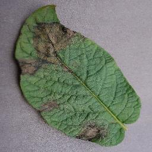

# potato_leaf_disease
A web app to detect disease of a potato leaf (CNN model)

In this project the dataset is taken from kaggle: https://www.kaggle.com/emmarex/plantdisease

There are three type of leaves that we have to classify using this model
1.	Early Blight Leaf

2.	Late Blight Leaf
 

 
 
3.  Healthy Leaf

